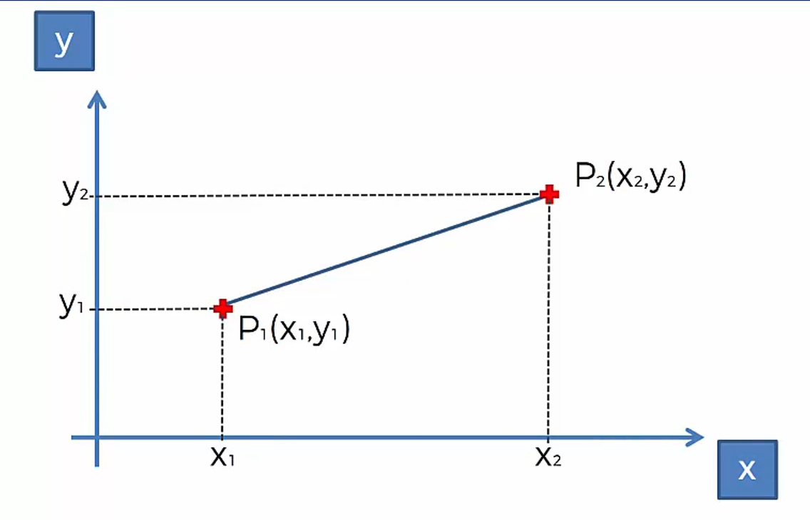
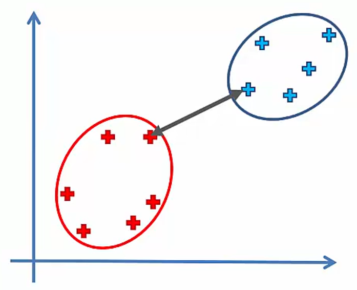

# Hierarchical Clustering

## HC Intuition: Understanding HC

### Agglomerative HC

* **STEP 1:** Make each data point a single-point cluster **→** That forms *N* clusters

* **STEP 2:** Take the two closest data points and make them one cluster **→** That forms *N-1* clusters

* **STEP 3:** Take the two closest clusters and make them one cluster **→** That forms *N-2* clusters

* **STEP 4:** Repeat **STEP 3** until there is only one cluster

* <table><tr><th>FIN</th></tr></table>

### Euclidean Distance

<code>Euclidean Distance between P1 and P2 = &#x221A;[(x2-x1)2 + (y2-y1)2]</code>

### Distance Between Clusters

**Distance Between Two Clusters:**

* Option 1: Closest Points

* Option 2: Furthest Points

* Option 3: Average Distance

* Option 4: Distance Between Centroids

## Download Resources
* <a href="Clustering Pros & Cons.ipynb" download>Clustering | Pros & Cons | Notebook</a>
* <a href="Python/Hierarchical Clustering.ipynb" download>Python Notebook</a>
* <a href="Python/Mall_Customers.csv" download>Dataset</a>
* <a href="R/Hierarchical Clustering.r" download>Hierarchical Clustering | R Code</a>

<a href="../Section 26 - K-Means Clustering">«Previous</a> | <a href="../Section 28 - Part 05 - Association Rule Learning">Next»</a>
