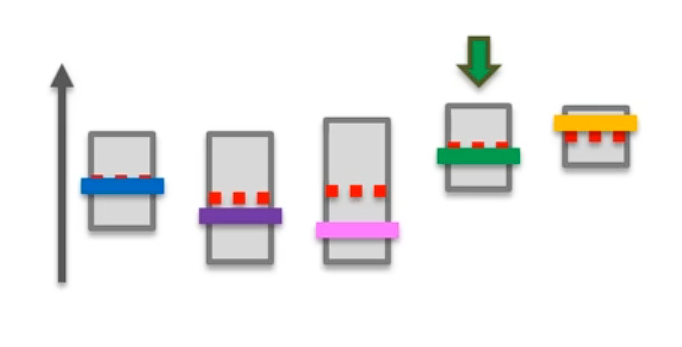

# Thompson Sampling

## Bayesian Inference

* Ad *i* gets rewards **y** from Bernoulli distribution <code>*p(**y**|θi) ~ ß(θi)*</code>

* *θi* is unknown but we set its uncertainty by assuming it has a uniform distribution <code>*p(θi)* ~ *u*([0, 1])</code>, which is the prior distribution.

* **Bayes Rule:** We approach *θi* by the posterior distribution

* We get <code>*p(θi|**y**) ~ ß(number of successes + 1, number of failures + 1)*</code>

* At each round *n* we take a random draw *θi(n)* from this posterior distribution *`p(θi|**y**)`*, for each ad *i*.

* At each round *n* we select the ad *i* that has the highest *θi(n)*.

## Thompson Sampling Algorithm

**Step 1:** At each round *n*, we consider two numbers for each ad *i*:
* *N1i(n)* - the number of times the ad *i* got reward *1* up to round *n*.
* *N0i(n)* - the number of times the ad *i* got reward *0* up to round *n*.

**Step 2:** For each ad *i*, we take a random draw from the distribution below:

&emsp;&emsp;&emsp;&emsp;&emsp;<code>θi(n) = ß(N1i(n) + 1, N0i(n) + 1)</code>

**Step 3:** We select the ad that has the highest *θi(n)*.

## UCB Algorithm v/s Thompson Sampling Algorithm

<table>
    <tr>
        <th>Upper Confidence Bound</th>
        <th>Thompson Sampling</th>
    </tr>
    <tr>
        <td></td>
        <td></td>
    </tr>
    <tr>
        <td>Deterministic</td>
        <td>Probabilistic</td>
    </tr>
    <tr>
        <td>Requires update at every round</td>
        <td>Can accommodate delayed feedback</td>
    </tr>
    <tr>
        <td>Less empirical evidence than Thompson Sampling</td>
        <td>Better empirical evidence than UCB</td>
    </tr>
</table>

## Download Resources
* <a href="Python/Thompson Sampling.ipynb" download>Python Notebook</a>
* <a href="Python/Ads_CTR_Optimisation.csv" download>Dataset</a>
* <a href="R/Thompson Sampling.r" download>Thompson Sampling | R Code</a>

<a href="../Section 32 - Upper Confidence Bound (UCB)">«Previous</a> | <a href="../Section 34 - Part 07 - Natural Language Processing (NLP)">Next»</a>
