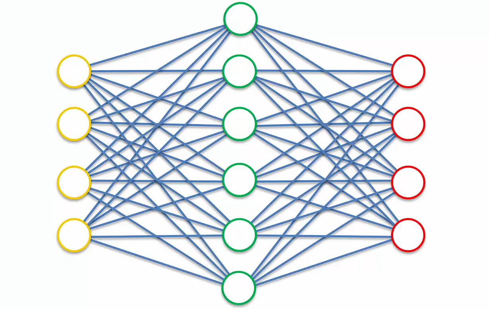

# Auto Encoders

## Auto Encoders

<table>
    <tr>
        <th>Supervised</th>
        <td>Artificial Neural Networks</td>
        <td>Used for Regression & Classification</td>
    </tr>
    <tr>
        <th></th>
        <td>Convolutional Neural Networks</td>
        <td>Used for Computer Vision</td>
    </tr>
    <tr>
        <th></th>
        <td>Recurrent Neural Networks</td>
        <td>Used for Time Series Analysis</td>
    </tr>
</table>
 
<table>
    <tr>
        <th>Unsupervised</th>
        <td>Self-Organizing Maps</td>
        <td>Used for Feature Detection</td>
    </tr>
    <tr>
        <th></th>
        <td>Deep Boltzmann Machines</td>
        <td>Used for Recommendation Systems</td>
    </tr>
    <tr>
        <th></th>
        <td><b>AutoEncoders</b></td>
        <td><b>Used for Recommendation Systems</b></td>
    </tr>
</table>

**Visual Representation of a Auto Encoder:**

* As the name suggests an *Auto Encoder* encodes itself.

* It takes some sort of inputs, put some through a hidden layer, and then it gets outputs, but it aims for the outputs to be identical to the inputs.

* Auto Encoders are not a pure type of *Unsupervised Deep Learning Algorithm*.

* They are actually a *Self-Supervised Deep Learning Algorithm*, because they are comparing to something on the end.

* The hidden layer is also called as the *coding layer* or the *bottleneck*.

**Uses:**

1. They can be used for feature detection.
2. They can also be used to build powerful recommender systems
3. They are used for encoding, basically.

### Additional Reading

#### *Neural Networks Are Impressively Good At Compression*

*By Malte Skarupke (2016)*

#### [Neural Networks Are Impressively Good At Compression - Malte Skarupke](https://probablydance.com/2016/04/30/neural-networks-are-impressively-good-at-compression/)

## Training an Auto Encoder

### Algorithm:

* **STEP 1:** We start with an array where the lines (*the observations*) correspond to the users and the columns (*the features*) correspond to the movies. Each cell (`u`, `i`) contains the rating (from `1` to `5`, `0` if no rating) of the movie `i` by the user `u`.

* **STEP 2:** The first user goes into the network. The input vector <code>x = (r1, r2, ..., rm)</code> contains all its ratings for all the movies.

* **STEP 3:** The input vector `x` is encoded into a vector `z` of lower dimensions by a mapping function `f` (e.g: *sigmoid function*):
 &emsp;&emsp;&emsp;&emsp; <code>z = f(Wx + b)</code> where &emsp;&emsp;&emsp;`W` is the *vector of input weights* and `b` the *bias*
 
 

* **STEP 4:** `z` is then decoded into the output vector `y` of same dimensions as `x`, aiming to replicate the input vector `x`.

* **STEP 5:** The reconstruction error `d(x, y) = ||x-y||` is computed. The goal is to minimize it.

* **STEP 6:** ***Back-Propagation:*** from right to left, the error is back-propagated. The weights are updated according to how much they are responsible for the error. The learning rate decides by how much we update the weights.

* **STEP 7:** Repeat Steps *1* to *6* and update the weights after each observation (*Reinforcement Learning*). Or: &emsp;&emsp;&emsp;&nbsp; Repeat Steps *1* to *6* but update the weights only after a batch of observations (*Batch Learning*).

* **STEP 8:** When the whole training set passed through the **ANN**, that makes an epoch. Redo more epochs.

### Additional Reading

#### *Building Autoencoders in Keras*

*By Francois Chollet (2016)*

#### [Building Autoencoders in Keras - Francois Chollet](https://blog.keras.io/building-autoencoders-in-keras.html)

## Sparse Autoencoders

* A *Sparse Autoencoder* is an autoencoder, where the hidden layer is greater than the input layer. But a *regularization technique* which introduces sparsity has been applied.

&emsp;&emsp;&emsp;

* A *regularization technique* basically means something that helps prevent over-fitting or stabilizes the algorithm.

### Additional Reading

#### *Deep Learning Tutorial - Sparse Autoencoder*

*By Chris McCormick (2014)*

#### [Deep Learning Tutorial - Sparse Autoencoder - Chris McCormick](http://mccormickml.com/2014/05/30/deep-learning-tutorial-sparse-autoencoder/)

### Additional Reading

#### *Deep Learning Tutorial: Sparse Autoencoders*

*By Eric Wilkinson (2014)*

#### [Deep Learning Tutorial: Sparse Autoencoders - Eric Wilkinson](http://ericlwilkinson.com/blog/2014/11/19/deep-learning-sparse-autoencoders/)

### Additional Reading

#### *k-Sparse Autoencoders*

*By Alireza Makhzani et al. (2014)*

#### [k-Sparse Autoencoders - Alireza Makhzani](http://arxiv.org/pdf/1312.5663.pdf)

## Denoising Autoencoders

* *Denoising Autoencoder* is another regularization technique, which is here to combat the problem of when we have more nodes in the hidden layers than in the input layer.

* Denoising Autoencoder is a *Stochastic Autoencoder*.

* It depends on the random generation or random selection of which values are going to be zeroed out and so it becomes a Stochastic type of Autoencoder.

### Additional Reading

#### *Extracting and Composing Robust Features with Denoising Autoencoders*

*By Pascal Vincent et al. (2008)*

#### [Extracting and Composing Robust Features with Denoising Autoencoders - Pascal Vincent](http://www.cs.toronto.edu/~larocheh/publications/icml-2008-denoising-autoencoders.pdf)

## Contractive Autoencoders

* *Contractive Autoencoder* is another regularization technique just like sparse autoencoders and denoising autoencoders, which is designed to combat the problem when we have an over-complete hidden layer in the autoencoder.

&emsp;&emsp;&emsp;

* It leverages the whole training process where information goes through the autoencoder, then we get the outputs and then they are compared with the inputs. *Contractive Autoencoders* add a penalty into this loss-function that has been propagated back through the network, and it specifically doesn't allow the autoencoder to just simply copy these values across.

### Additional Reading

#### *Contractive Auto-Encoders: Explicit Invariance During Feature Extraction*

*By Salah Rifai et al. (2011)*

#### [Contractive Auto-Encoders: Explicit Invariance During Feature Extraction - Salah Rifai](http://machinelearning.wustl.edu/mlpapers/paper_files/ICML2011Rifai_455.pdf)

## Stacked Autoencoders

* A *Stacked Autoencoder* is if we add another hidden layer into our autoencoder. So, we have two stages of encoding and one stage of decoding.

### Additional Reading

#### *Stacked Denoising Autoencoders: Learning Useful Representations in a Deep Network with a Local Denoising Criterion*

*By Pascal Vincent et al. (2010)*

#### [Stacked Denoising Autoencoders - Pascal Vincent](http://www.jmlr.org/papers/volume11/vincent10a/vincent10a.pdf)

## Deep Autoencoders

* **NOTE:** *Stacked Autoencoders* are **not the same thing** as *Deep Autoencoders*.

&emsp;&emsp;&emsp;

* These are Restricted Boltzmann Machines (RBMs) that are Stacked. Then they are pre-trained layer by layer. Then they are unrolled. Then they're fine tuned with back propagation. So then you do get directionality in your network and then you have back propagation.

* In essence, a Deep Autoencoder comes from **RBMs**.

* *Stacked Autoencoders* are just **normal autoencoders stacked**. A *Deep Autoencoder* is **RBMs stacked on top of each other** and then certain things are done with them in order to achieve a autoencoding mechanism.

### Additional Reading

#### *Reducing the Dimensionality of Data with Neural Networks*

*By Geoffrey Hinton et al. (2006)*

#### [Reducing the Dimensionality of Data with Neural Networks - Pascal Vincent](https://www.cs.toronto.edu/~hinton/science.pdf)

<a href="../">«Previous</a> | 
